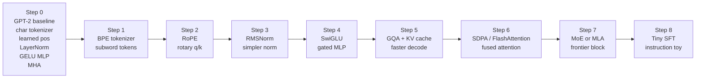
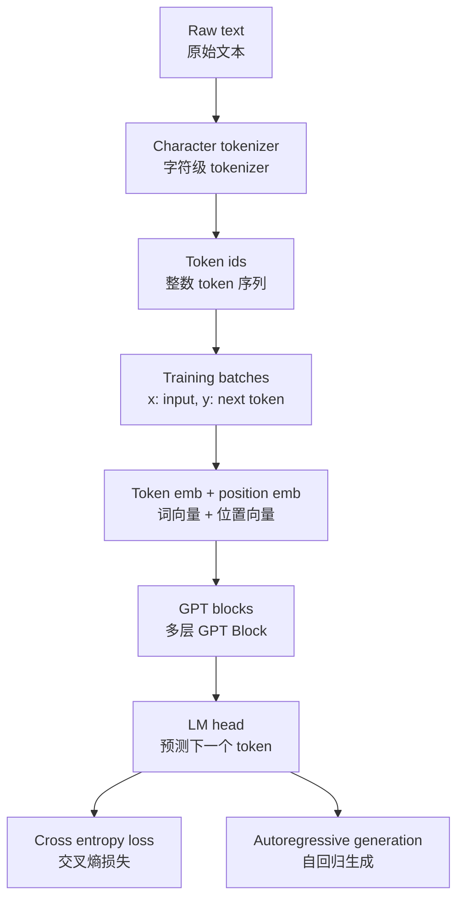
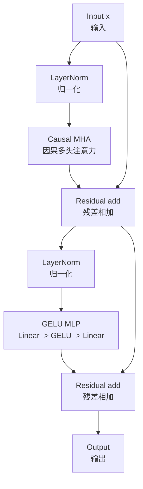
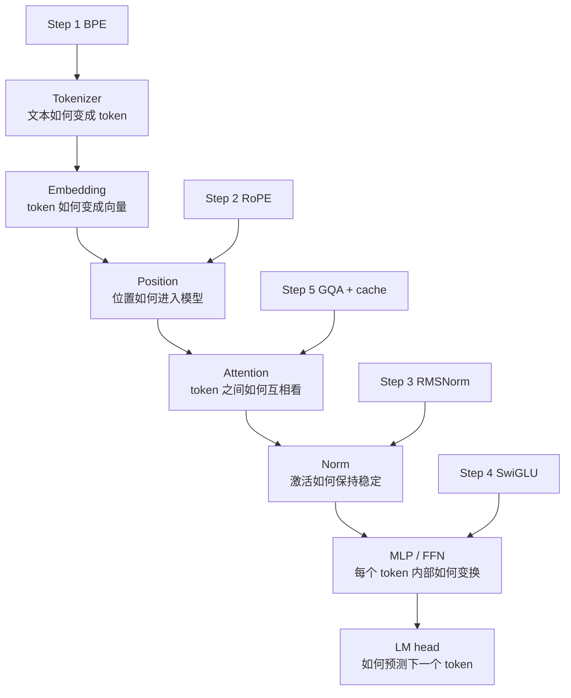
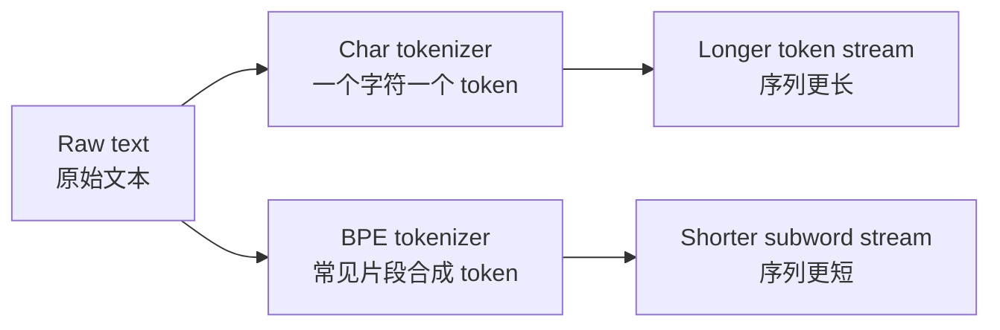
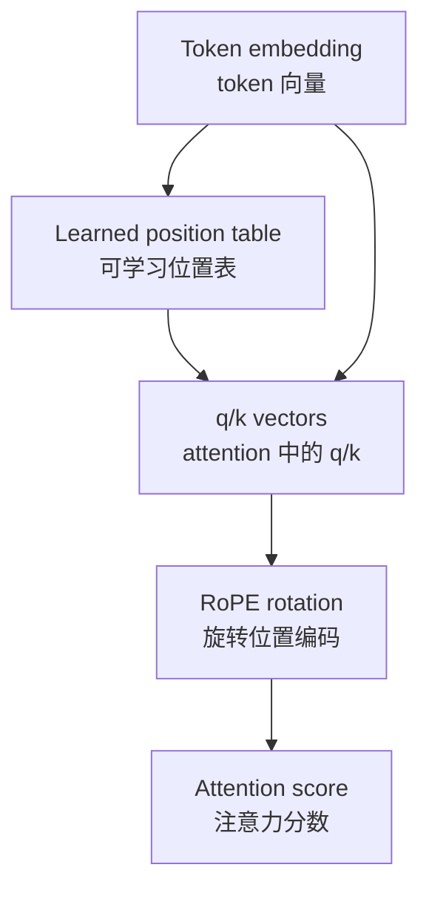
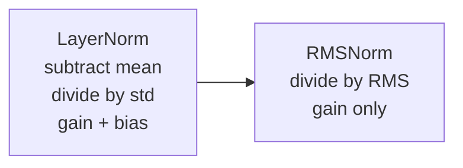
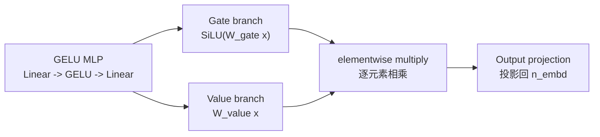
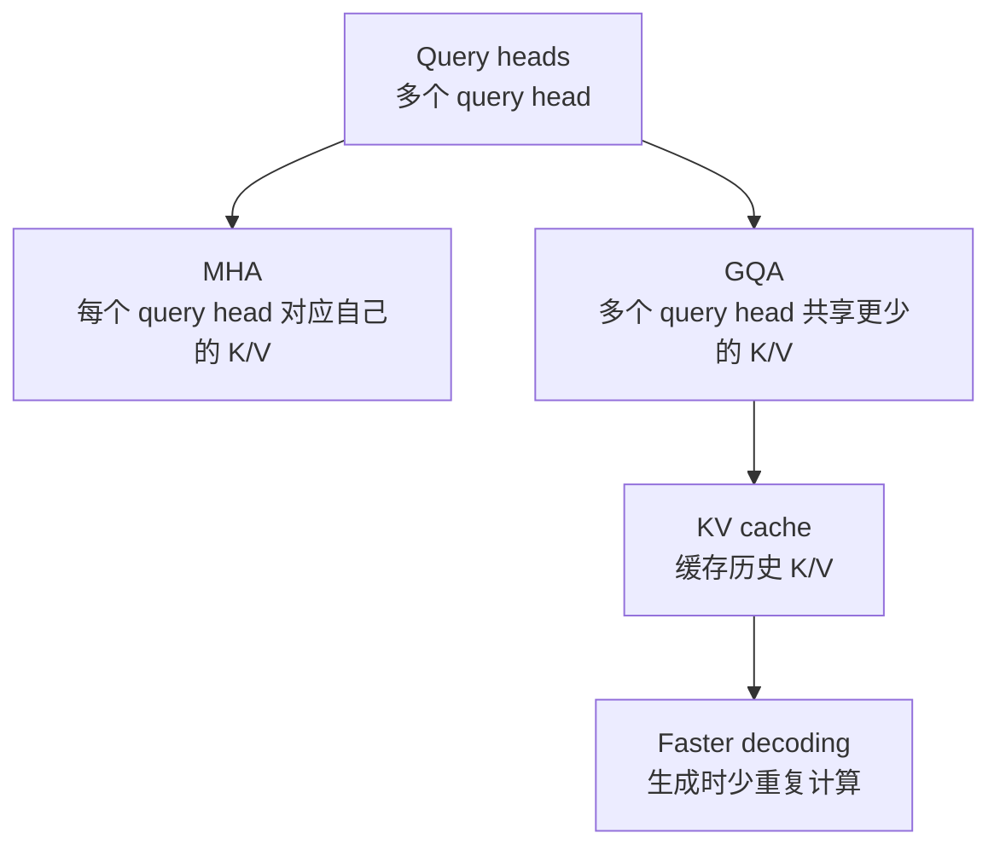

# Architecture Roadmap / 架构路线图

This page is the visual map for `gpt2-to-2026`: what the baseline model looks
like, where each modern upgrade attaches, and what should be compared in the
future interactive demo.

这一页是 `gpt2-to-2026` 的图解地图：baseline 模型长什么样、每个现代 LLM 组件改在
哪里、未来交互式 Demo 应该展示哪些对比。

## 1. Full Upgrade Path / 完整升级路径

**English:** Each step changes one intended component while keeping the rest of
the experiment as fixed as possible.

**中文：** 每一步只改变一个目标组件，其余条件尽量保持不变。这样才能判断“这次升级”到底带来了什么。

## 2. Baseline Training Flow / Baseline 训练流程

**English:** GPT training is next-token prediction. Given token sequence
`x[0:T]`, the model learns to predict `x[1:T+1]`.

**中文：** GPT 训练本质上是“预测下一个 token”。给模型一段 token 序列 `x[0:T]`，
让它学习预测右移一位的序列 `x[1:T+1]`。

## 3. Baseline GPT Block / Baseline GPT Block 结构

**English:** This is the reference block. Later upgrades replace one part at a
time: position encoding, normalization, MLP, or attention.

**中文：** 这是后续所有实验的参照组。之后的升级会逐个替换其中某一部分：位置编码、归一化、
MLP 或 attention。

## 4. Component Map / 组件对应图

**English:** This is the mental model for the whole repo. Every upgrade is tied
to a specific model subsystem.

**中文：** 这是理解整个仓库的心智模型。每一次升级都对应模型中的一个具体子系统。

## 5. What Each Step Changes / 每一步改了什么

| Step | Component / 组件 | Baseline / 原始做法 | Upgrade / 升级做法 | Observe / 观察指标 |
| --- | --- | --- | --- | --- |
| 1 | Tokenizer | character-level | byte-level BPE | token count, samples, speed |
| 2 | Position | learned absolute table | RoPE on q/k | loss, long prompt behavior |
| 3 | Norm | LayerNorm | RMSNorm | params, stability, loss |
| 4 | MLP | GELU MLP | SwiGLU gated MLP | loss and sample quality |
| 5 | Attention inference | MHA, no cache | GQA + KV cache | decode tok/s, KV memory |
| 6 | Attention kernel | explicit attention | SDPA / FlashAttention | train speed, memory |
| 7 | Frontier block | dense Transformer | MoE or MLA | capability vs complexity |
| 8 | Objective | next-token LM | SFT | instruction following |

## 6. Step Deltas / 每一步的差分图

### Step 1: BPE Tokenizer

**Why / 为什么：** Character tokenization is easy to debug, but real GPT-like
models use subword tokenization. BPE usually makes sequences shorter and handles
mixed text better.

字符级 tokenizer 很容易调试，但真实 GPT 类模型通常用子词 tokenizer。BPE 往往能缩短序列，
也更适合英文、符号、代码等混合文本。

### Step 2: RoPE

**Why / 为什么：** GPT-2 learns an absolute position vector. RoPE puts position
information into query/key geometry, which is why many modern LLMs use it.

GPT-2 使用可学习的绝对位置向量。RoPE 把位置信息放进 q/k 的几何关系里，因此被许多现代
LLM 采用。

### Step 3: RMSNorm

**Why / 为什么：** RMSNorm removes mean subtraction and bias. It is simpler than
LayerNorm and common in modern decoder-only LLMs.

RMSNorm 去掉了减均值和 bias，比 LayerNorm 更简单，是现代 decoder-only LLM 中常见的归一化方式。

### Step 4: SwiGLU

**Why / 为什么：** SwiGLU adds a gate to the feed-forward block. The model can
select which features pass through for each token.

SwiGLU 给 FFN 加了“门控”。模型可以对每个 token 动态选择哪些特征通过。

### Step 5: GQA + KV Cache

**Why / 为什么：** During generation, old tokens do not change. KV cache reuses
their key/value tensors. GQA stores fewer K/V heads, reducing cache memory.

生成时，历史 token 不会改变。KV cache 会复用历史 token 的 key/value。GQA 进一步减少 K/V
head 数量，从而降低 cache 显存。

## 7. Future Interactive Demo / 未来交互式 Demo

The eventual demo should let a reader click a step and see synchronized views:

未来的 Demo 可以让读者点击某一步，然后同时看到：

- architecture diff / 架构差异：模型哪里变了
- metrics diff / 指标差异：loss、tokens/sec、显存、checkpoint 大小
- behavior diff / 行为差异：同一个 prompt 的生成样例
- code diff / 代码差异：关键模块对应的最小代码变化

The first useful version can be a static web page backed by exported
`reports/runs/<name>/` artifacts. A later version can load checkpoints locally
and generate text interactively.

第一个版本可以先做成静态网页，读取 `reports/runs/<name>/` 中导出的结果。后续版本再支持本地加载
checkpoint 并交互式生成文本。
