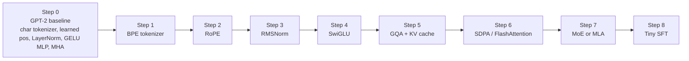
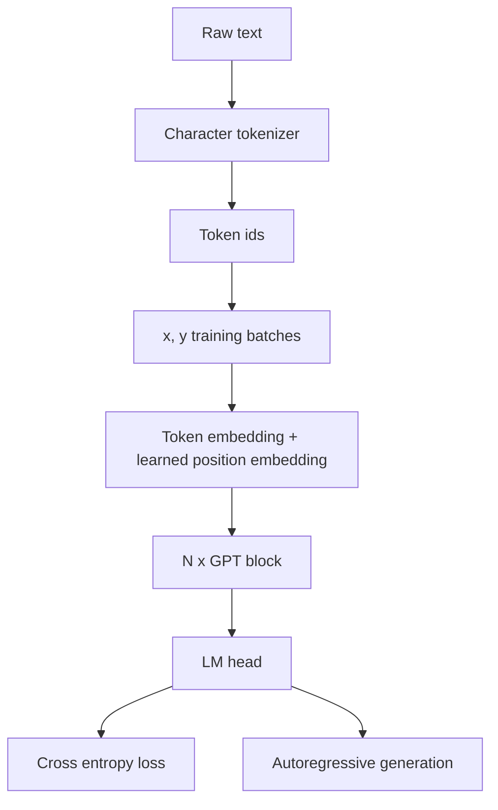
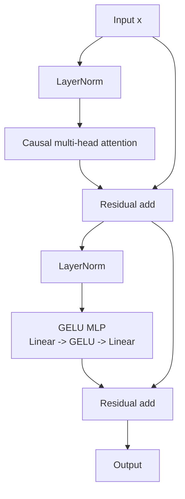
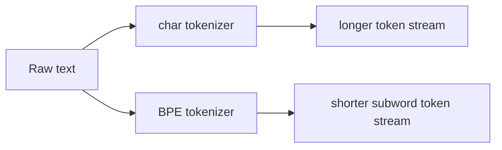
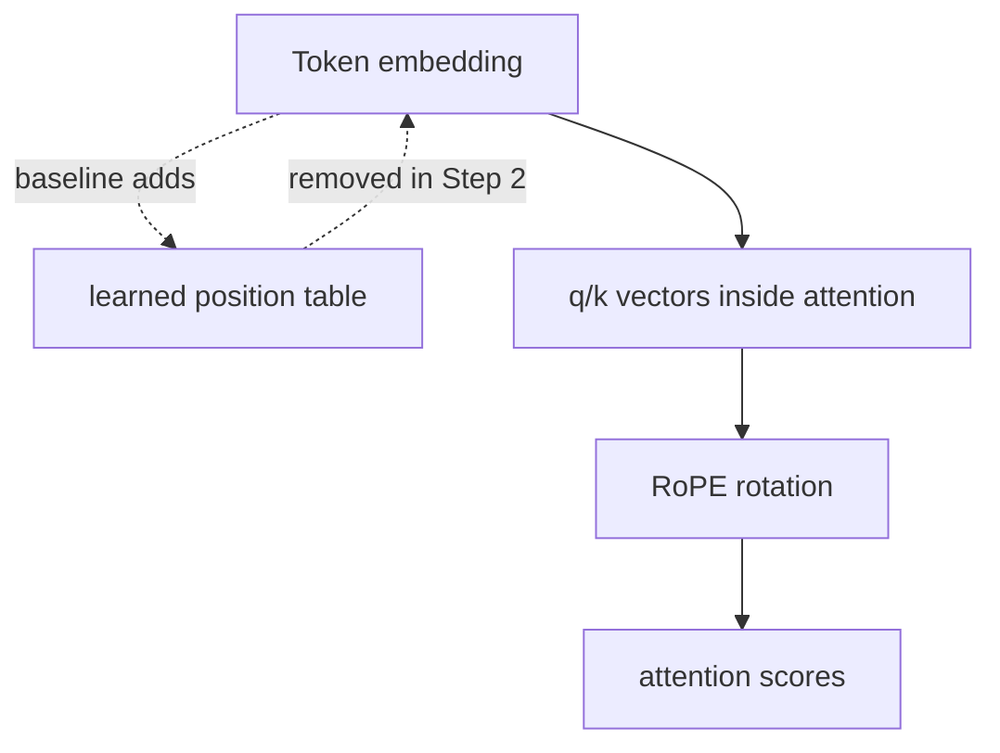
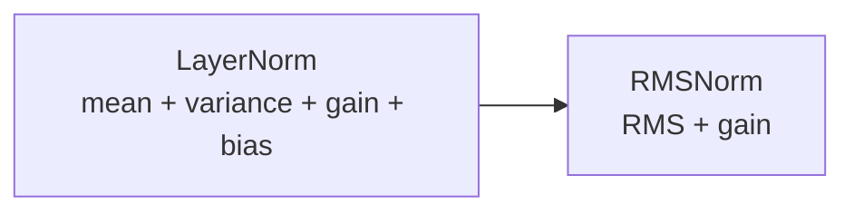
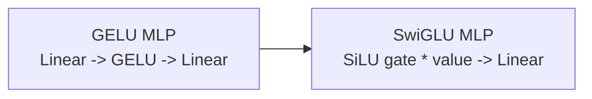
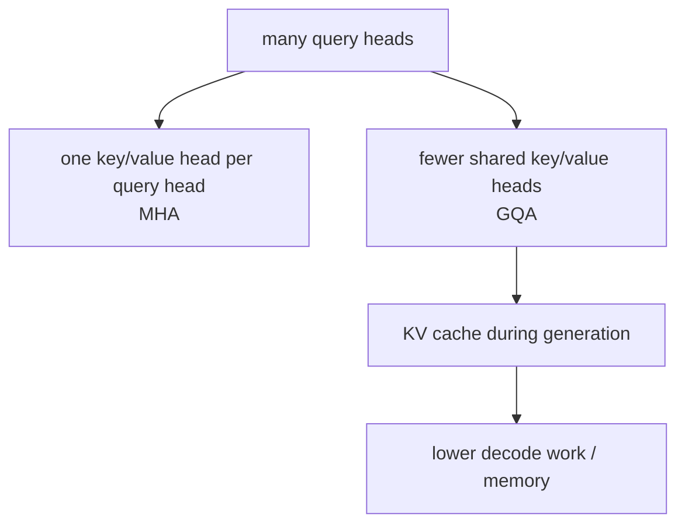

# Architecture Roadmap

This page is the visual map for `gpt2-to-2026`: what the baseline model looks
like, where each modern upgrade attaches, and what should be compared in the
future interactive demo.

## Upgrade Path

The important rule: each step changes one intended component while keeping the
rest of the experiment as fixed as possible.

## Baseline Data Flow

## Baseline GPT Block

## What Each Step Changes

| Step | Component | Baseline | Upgrade | Main thing to observe |
| --- | --- | --- | --- | --- |
| 1 | Tokenizer | character-level | byte-level BPE | token count, samples, speed |
| 2 | Position | learned absolute table | RoPE on q/k | loss, long prompt behavior |
| 3 | Norm | LayerNorm | RMSNorm | params, stability, loss |
| 4 | MLP | GELU MLP | SwiGLU gated MLP | loss and sample quality |
| 5 | Attention inference | MHA, no cache | GQA + KV cache | decode tok/s, KV memory |
| 6 | Attention kernel | explicit attention | SDPA / FlashAttention | train speed, memory |
| 7 | Frontier block | dense Transformer | MoE or MLA | capability vs complexity |
| 8 | Objective | next-token LM | SFT | instruction following |

## Step Deltas

### Step 1: BPE

### Step 2: RoPE

### Step 3: RMSNorm

### Step 4: SwiGLU

### Step 5: GQA + KV Cache

## Future Interactive Demo

The eventual demo should let a reader click a step and see three synchronized
views:

- architecture diff: which block changed
- metrics diff: loss, tokens/sec, memory, checkpoint size
- behavior diff: generated samples from the same prompt

The first useful version can be a static web page backed by exported
`reports/runs/<name>/` artifacts. A later version can load checkpoints locally
and generate text interactively.
